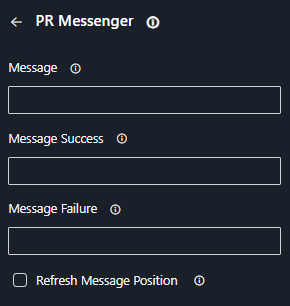

# Pr Messenger

An extension that enables users to easily add a alterable comment to pull requests.

## Features

- Add or edit a comment to a pull request
- Specific message for `Success` and `Failure` states
- Option to bring up the comment to the top of the pull request comments

## Requirements

- Give the right `Contribute to pull requests` to the build user

## Parameters

| Name                   | Description                                                                            | Required | Default |
|------------------------|----------------------------------------------------------------------------------------|----------|---------|
| message                | The default message displayed, supports Markdown and all valid Unicode characters.     | No       |         |
| messageSuccess         | A message override, printed in case of success.                                        | No       |         |
| messageFailure         | A message override, printed in case of failure.                                        | No       |         |
| refreshMessagePosition | If set to `true`, the comment will be brought to the top of the pull request comments. | No       | `false` |

## Configuration

### From the UI

1. Search for `PR Messenger` in the`Tasks` tab<br/>
2. Fill the form with the required information<br/>

### From the YAML

```yaml
  - task: PrMessenger@0
    inputs:
      message: <default message>
      messageSuccess: <message on success>
      messageFailure: <message on failure>
      refreshMessagePosition: true | false
```

Example:

```yaml
  - task: PrMessenger@0
    inputs:
      messageSuccess: |
        # ✔ Build successful
        Website preview for branch `${{ replace(variables['System.PullRequest.SourceBranch'], 'refs/heads/', '') }}` is available at [$(previousStep.siteUrl)]($(previousStep.siteUrl)).
        [🛠 Last build result]($( System.CollectionUri )$( System.TeamProject )/_build/results?buildId=$( Build.BuildId )&view=results)
      messageFailure: |
        # ❌ Build failed
        [🛠 Last build result]($( System.CollectionUri )$( System.TeamProject )/_build/results?buildId=$( Build.BuildId )&view=results)
      refreshMessagePosition: true
```

## Development

See the [CONTRIBUTING guide](../../CONTRIBUTING.md).
